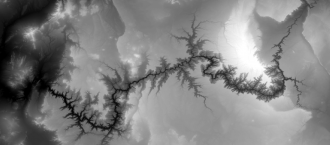
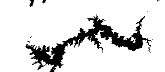

#Naive Bruteforce Method




This is the first method I have tried to delineate basins. Given a matrix
(created from a colorless image) of heights and a starting coordinate, it
spreads out, adding higher or equal points to a stack, also marking them on
the result matrix, while ignoring points that go out of bounds or are already
marked on the result matrix. It then writes the result to a black and white
image.

The program is written in Python 3 and depends on
[SciPy](https://www.scipy.org).

The program's argument signature is:
```
python3 basin_bruteforce.py <INPUT IMAGE> <X> <Y> <OUTPUT IMAGE>
```

## Issues
This algorithm does not yet run the desired
[DEM](https://en.wikipedia.org/wiki/Digital_elevation_model), which is
specifically at this time a 3GiB GeoTIFF of the contiguous United States.
This is because the library will fail with a Memory Error when trying to load
it. This might be remedied with using a different platform (C, C++, Java,
etc.) or splitting the file into chunks.

The algorithm is also flawed in it's approach. It doesn't handle flat area
properly (It equates it with inward sloping) and "sinks" which are depressions
contained within the drainage basin.

## Future work

This will involve more reaserch and development.

Future features of a successor of this algorithm must include:
* Input of standard coordinates instead of matrix location.
* Much more optimization.
* Integration with soil data analysis and the larger system.
* Output in a format that can be used in Leaflet frontend.

Additional features could include:
* Parallelism
* Caching of previously calculated basins

